class: inverse, center, middle

```{r, echo=F,out.width = "500px",fig.align="center", fig.cap="Man with Cuboid (Kroonenberg, 2008)"}
# install.packages("cowplot")
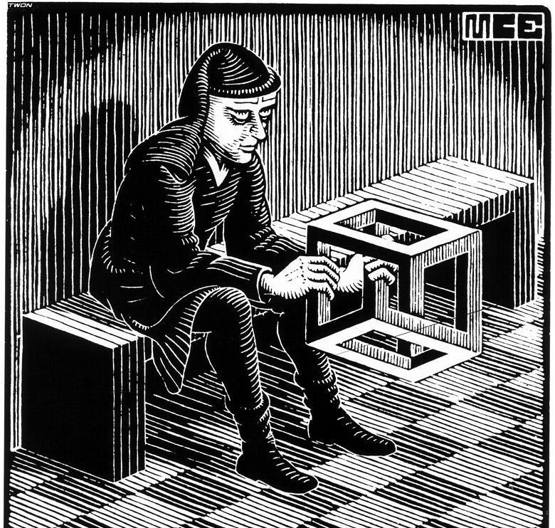
```

---

class: inverse, center, middle


---

class: inverse, center, middle

# Why should we care about Tensors?

???

Why should we care about tensors? Why do I care about tensors? Generally...
- Tensors are a mathematical tool for data analysis. 
- They generalize operations of matrices to higher dimensions 
- Tensors possibly offer more natural representations of data (consider image changing over time)

- Area of development: Overall, not well documented in the psychological measurement literature. 1 instance of the term tensor in SEM, 29 in Psychometrika, 0 in psychological methods. Similarly, for the term multiway 6 articles in SEM, we see 89 articles in psychometrika, and 1 instance in psychological methods. 

---
# Era of Big Data

- Big data consists of multidimensional, multimodal datasets
- Five "V"s of big data: Volume - scale of data, Variety - different forms of data, Veracity -
uncertainty of data, and Velocity - analysis of streaming data
- Tensors and Tensor Decompositions provide a way of representing and handling this complexity

```{r, echo=F,out.width = "400px",fig.align="center", fig.cap="Big Data Analysis (Chichocki, 2014)"}
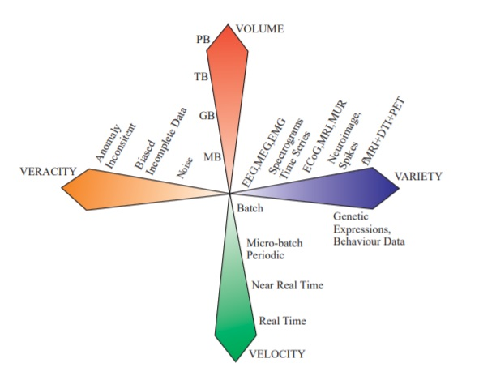
```

???

Overall, the benefits of multiway (tensor) analysis methods can be summarized as by Cichocki (2014):
- Super compression of huge multidimensional, structured data which admits a low-rank approximation via TNs of high-order tensors by extracting factor matrices and/or core tensors of low-rank and low-order and perform all mathematical manipulations in tensor formats (especially, TT and HT formats).
- These low-rank matrices are often unique (i.e., do not suffer from the rotational issue of factor indeterminancy)
- A compact and very flexible approximate representation of structurally rich data by accounting for their spatio-temporal and spectral dependencies.
- Opportunity to establish statistical links between cores, factors, components or hidden latent variables for blocks of data.
- Possibility to operate with noisy, incomplete, missing data by using powerful low-rank tensor/matrix approximation techniques.
- A framework to incorporate various diversities or constraints in different modes and thus naturally extend the standard (2-way) CA methods to largescale multidimensional data.

- Big Data consists of multidimensional, multimodal datasets that are so huge and complex that they cannot be easily stored or processed by using standard computers.
- Data in psychology is often multimodal and multidimensional
  - For example, in education there is a push for response process data
- Volume - Petabye, terabyte, gigabyte, megabyte?, etc.

  
---
# Overview of Talk

1. Background Singular Value Decomposition (SVD) and Principal Components Analysis (PCA) 
  - Open **tensor-tutorial.rmd** workbook in R
  - Change path to 'girlsgrowth' data & install relevant pacakges (see commented code)  
  - Click Run Document

2. History and Background Tensors

3. Basic Notation and Matrix Products

4. Tensor Decompositions
  - CANDECOMP/PARAFAC (CP)
  - Tucker3

5. Demonstrations using R
  - We will return to the **tensor-tutorial.rmd** workbook

.footnote[ 
[1] Note throughtout I build on the work of Kroonenberg (2008), Kolda & Bader (2009).
]

???
We start with a discussion of PCA and SVD because these are classic techniques for matrix factorization. In particular, they all seek to approximate the full dataset or matrix as the product of low-rank factor matrices. Tensor Decompositions extend this idea to higher-order dimensions. 

---

class: inverse, center, middle

# History and Background Tensors

---
# History

- The origin of the term tensor is from applied mathematics (Hitchcock, 1927; Jordan, 1874)
  - Also known as multiway arrays or multimode data (Kroonenberg, 2008)

- Models for analyzing tensors originate in the psychometric literature (Carroll & Chang, 1970; Cattell, 1944, 1966; Harshman, 1970; Tucker, 1966)

- Tensor decompositions and applications primarily popularized in the field of chemometrics (Kroonenberg, 2008; Kolda & Bader, 2009)

- Recently, interest in tensor decompositions has been in the fields of signal processing, numerical linear algebra, computer vision, numerical analysis, graph analysis, and nueroscience (Kolda & Bader, 2009)

- *Applied Multiway Data Analysis* (Kroonenberg, 2008) useful book eminating from psychometric tradition

- PARAFAC with basis function expansion approximations (Choi & Hwang, 2018)

???

- Cattell 1944 wrote a paper about "parallel proportional profiles" and other principals for determing the choice of factors by rocations. The paper is often cited as origin of multiway analysis because it described this idea of parallel proportion profiles which can be thought of as simultaneous simple structure. 

- Harshman (1970) demonstrated an extension of Cattell's principle of rotation to Proportional Profiles (PP) that offerd a basis for determining explanatory factors for three-way or higher order multi-mode data. Harshman noted that the parallel proportion profiles as demonstrated by Cattell were restricted to orthogonal factors. The generalized PP model was developed to give unique "correct" solutions with oblique, non-simple structure, and even non-linear factor structures.

- Carroll & Change (1970) developed an individual differences model for multidimensional scaling in which individuals are assumed differentially to weight the several dimensions of a common "psychological space". A corresponding method
of analyzing similarities data is proposed, involving a generalization of
"Eckart-Young analysis" to decompositionof three-way (or higher-way) tables.

- Currently, the methods developed by Harshman and Tucker are restricted to three-way analysis and typically use time as the third mode. Choi & Hwang (2018)  extend existing functional PARAFAC methods, that currently only handle functions of a one-dimensional argument (e.g., time) onl,to be able to handle three-way data whose responses are sequenced along both a two-dimensional domain (e.g., a plane with x- and y-axis coordinates) and a one-dimensional argument.


---
# What is a Tensor?

- A tensor is a multidimensional or *N*-way array

- Formally, an *N*-way or *N*th-order tensor is the tensor product of *N* vector spaces
  - **Order** refers to the number of dimensions, ways, or modes
  - A vector space is a collection of vectors that can be added/multiplied
  - Each vector space contains its own coordinate system

- In general,
  - A 1st-order tensor is a **vector**
  - A 2nd-order tensor is a **matrix**
  - A 3rd-order or higher-order are referred to as **high-order tensors**
  
- For this talk, we will focus on higer-order tensors

---
# Example of a 3rd-Order Tensor

- A 3rd-order Tensor $\Large \mathbf{\mathcal{M}} \in \mathbb{R}^{IxJxK}$ with indices *I*, *J*, and *K*

- Tensors are denoted by boldface Euler scripts

```{r, echo=F,out.width = "350px",fig.align="center"}
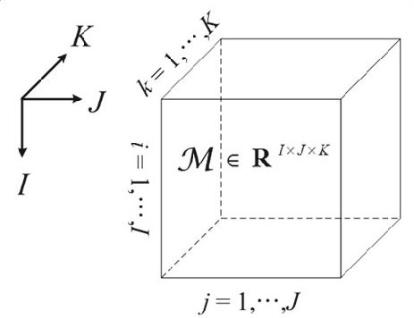
```


---
# Cattell's Data Box

- Cattell's data box (Cattell, 1966) is a common psychometric depiction of a 3rd-order tensor
- P, Q, R, S, T, and O techinques are various factor analytic techniques proposed by Cattell for conducting factor analysis using different modes of the data
```{r, echo=F,out.width = "350px",fig.align="center"}
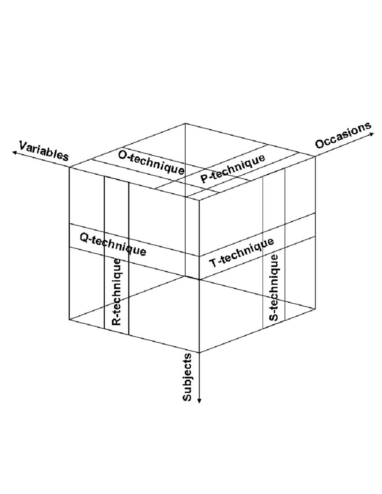
```

---

Given the three primary dimensions of variables, persons, and occasions, at least 6 different structural relationships can be utilized to address specific research questions

```{r, echo=F,out.width = "400px",fig.align="center", fig.cap="Nesselroade and Cattell (1988)"}
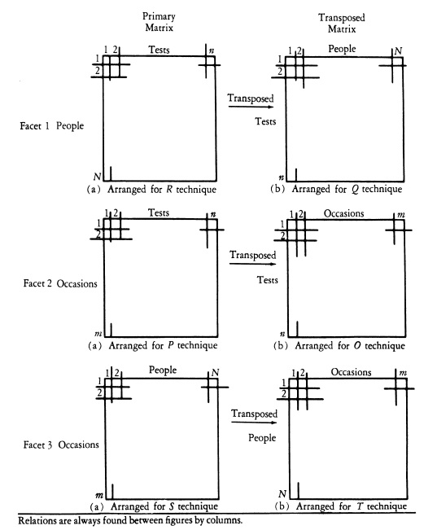
```

???

R-Technique: People by Tests (Variables) 
  - Most common Factor Analysis approach

Q-Technique: Tets (Variables) by People
  - Cluster analysis - subgroups of people

P-Technique: Occasions by Tests (Variables)
  - Intra-individual time series analyses

O-Technique: Tests(Variables) by Occassions
  - Time-dependent (historical) clusters

S-Technique: Occassions by People
  - People clustering based on growth patterns

T-Technique: People by Occasions
  - Time-dependent clusters based on people

---

class: inverse, center, middle

# Basic Notation and Matrix Products

---
# Notation and Preliminaries

- We will cover
  - Subtensors or Subarrays
  - Norm of a tensor
  - Rank-1 Tensor
  - Tensor Multiplication
  - Knronecker, Khartri-Rao, and Hadamard Products
  
- Not covered 
  - Symmetry and Tensors
  - Diagonal tensors (imagine a diagonal of 1's through third-order tensor)
  - Matricization: Transforming a Tensor into a Matrix
  

---
# Subtensors or Subarrays

```{r, echo=F,out.width = "350px",fig.align="center"}
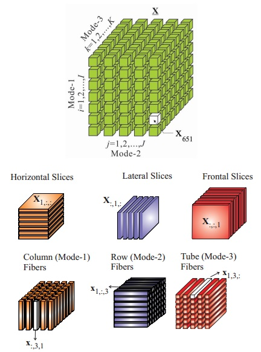
```

???

A third order tensor with entries $x_{i,j,k} = \mathbf{\mathcal{X}}(i,j,k)$ and it's subtensors. Slices and fibers. All fibers are treated as column vectors.

Fibers are higher-order analogue of matrix rows & columns. A fiber is defined by fixing every index but one. A matrix column is a mode-1 fiber ($x:jk$), a matrix row a mode-2 fiber ($xi:k$), and a "tube" is referred to as a mode-3 fiber ($xij:$).

Slices are two-dimensional sections of a tensor, defined by fixing all but two indices. Horizontal, Lateral, and Frontal slices are denoted by $Xi::$, $X:j:$, and $X::k$. 

---
# Norm & Inner Product

- The norm of a tensor $\Large \mathbf{\mathcal{X}} \in \mathbb{R}^{I_{1} \times I_{2} \times...\times I_{N}}$ is the square root of the sum of the squares of all the tensors elements. 


$$\Large ||\mathbf{\mathcal{X}}|| = \sqrt{\sum^{I_{1}}_{i_{1}=1}\sum^{I_{2}}_{i_{2}=1}...\sum^{I_{N}}_{i_{N}=1}x^2_{i_{1}i_{2},...,i_{N}}}$$

- The inner product of two tensors with the same dimensions $\Large \mathbf{\mathcal{X,Y}} \in \mathbb{R}^{I_{1} \times I_{2} \times ...\times I_{N}}$ is the sum of the product of their entries 

$$\Large \langle \mathbf{\mathcal{X,Y}} \rangle = \sum^{I_{1}}_{i_{1}=1}\sum^{I_{2}}_{i_{2}=1}...\sum^{I_{N}}_{i_{N}=1}x_{i_{1}i_{2},...,i_{N}}y_{i_{1}i_{2},...,i_{N}}$$
- Consequently, 

$$\Large \langle \mathbf{\mathcal{X,X}} \rangle =||\mathbf{\mathcal{X}}||^2$$
---
# Rank-1 Tensor

- An *N*-way tensor  $\Large \mathbf{\mathcal{X}} \in \mathbb{R}^{I_{1}xI_{2}x...xI_{N}}$ is considered a rank-1 tensor if it can be writter as the outer product of *N* vectors

$$\Large \mathbf{\mathcal{X}} = \bf{a}^{(1)} \circ \bf{a}^{(2)} \circ ... \circ \bf{a}^{(N)}$$

- Here, $\Large \circ$ is represents the vector outer product. This means that each element of the tesnor is a the product of the corresponding vector elemnts

$$\Large x_{i_{1}i_{2}...i_{N}} = a^{(1)}_{i1}a^{(2)}_{i2} ... a^{(N)}_{iN}$$ for all $\Large 1 \leq i_{n} \leq I_{N}$

- Below is an example third-order rank-one tensor $\Large \mathbf{\mathcal{X}} = \bf{a} \circ \bf{b}\circ \bf{c}$

```{r, echo=F,out.width = "250px",fig.align="center"}
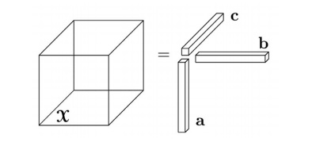
```
---
# Tensor Multiplication

- Tensors can be multiplied together

- Notation and symbology more complex than that of matrix multiplication (cf. Kolda, 2006)

- A basic tensor multiplication procedure is referred to as the ***n*-Mode product**

- The n-mode product is the product of a tensor $\Large \mathbf{\mathcal{X}} \in \mathbb{R}^{I_{1} \times I_{2} \times...\times I_{N}}$ with a matrix $\Large \mathbf{{U}} \in \mathbb{R}^{J \times I_{n}}$ is denoted by $\Large \mathbf{\mathcal{X}}  \times_{n} \mathbf{{U}}$ and is of size $I_{1} \times ... \times I_{n-1} \times J \times I_{n+1} \times ... \times I_{N}$

$$\Large (\mathbf{\mathcal{X}}  \times_{n} \mathbf{{U}})_{i_{1} \times ... \times i_{n-1} \times j \times i_{n+1} \times ... \times i_{N}} = \sum^{I_{n}}_{i_{n}=1}x_{i_{1}i_{2}...i_{n}u_{{ji}_{n}}}$$
- Each mode-*n* fiber is multiplied by the matrix $\Large \mathbf{{U}}$

---
# Example *n*-Mode product

- Let's consider a tensor of size $\Large \mathbf{\mathcal{X}} \in  \mathbb{R}^{3 \times 4 \times 2}$
 with frontal slices 
 
 $$\Large X_{1} = \begin{bmatrix} 1 & 4 & 7 & 10 \\ 2 & 5 & 8 & 11 \\ 3 & 6 & 9 & 12 \end{bmatrix} \quad \Large X_{2} = \begin{bmatrix} 13 & 16 & 19 & 22 \\ 14 & 17 & 20 & 23 \\ 15 & 18 & 21 & 24 \end{bmatrix}$$

- Let 
$$\Large \mathbf{U} = \begin{bmatrix} 1 & 3 & 5 \\ 2 & 4 & 6 \end{bmatrix}$$
- Then the product $\Large \mathbf{\mathcal{Y}} = \mathbf{\mathcal{X}}  \times_{1} \mathbf{{U}} \in \mathbb{R}^{2 \times 4 \times 2}$ is
 $$\Large Y_{1} = \begin{bmatrix} 22 & 49 & 76 & 103 \\ 28 & 64 & 100 & 136 \end{bmatrix} \quad \Large Y_{2} = \begin{bmatrix} 130 & 157 & 184 & 211 \\ 172 & 208 & 244 & 280 \end{bmatrix}$$

???

We obtain this result by multiplying U by X1 and X2 using dot products
  - $\Large 1x1 + 3x2 + 5x3 = 22$ 
  - $\Large 2x1 + 4x2 + 6x3 = 28$
  - $\Large 1x13 + 3x14 + 5x15 = 130$
  - $\Large 2x13 + 4x14 + 6x15 = 172$

---
# Knronecker Product

- The *Kronecker product* of matrices $\Large \mathbf{A} \in \mathbb{R}^{I \times J}$ and $\Large \mathbf{B} \in \mathbb{R}^{K \times L}$ is denoted by $\Large \mathbf{A} \otimes \mathbf{B}$. The result is a matrix of size $\Large (IK) \times (JL)$ and defined by

$$\Large \mathbf{A} \otimes \mathbf{B} = \begin{bmatrix} a_{11}\mathbf{B} & a_{12}\mathbf{B} & \dots & a_{1J}\mathbf{B} \\ a_{21}\mathbf{B} & a_{22}\mathbf{B} & ... & a_{2J}\mathbf{B} \\ \vdots & \vdots & \ddots & \vdots \\ a_{I1}\mathbf{B} & a_{I2}\mathbf{B} & \dots & a_{IJ}\mathbf{B} \end{bmatrix}$$
 
$$\Large = \begin{bmatrix}  \mathbf{a_{1}} \otimes \mathbf{b_{1}} & \mathbf{a_{1}} \otimes \mathbf{b_{2}} & \mathbf{a_{1}} \otimes \mathbf{b_{3}} \dots \mathbf{a_{J}} \otimes \mathbf{b_{L-1}} & \mathbf{a_{J}} \otimes \mathbf{b_{L}} \end{bmatrix}$$

---
# Example Knronecker Product

$$\Large \textbf{A} = \begin{bmatrix} 2 & 1  \\ 3 & 4  \end{bmatrix} \quad \Large \textbf{B} = \begin{bmatrix} \frac{1}{2} & 1  \\ 2 & 0  \end{bmatrix}$$

$$\Large \mathbf{A} \otimes \mathbf{B} = \begin{bmatrix}  2\textbf{B} & 1\textbf{B} \\ 3\textbf{B} & 4\textbf{B} \end{bmatrix} = \begin{bmatrix} 1 & 2 & \frac{1}{2} & 1 \\ 4 & 0 & 2 & 0 \\ \frac{3}{2} & 3 & 2 & 4 \\ 6 & 0 & 8 & 0 \end{bmatrix}$$

$$\Large \mathbf{B} \otimes \mathbf{A} = \begin{bmatrix}  2\textbf{A} & 1\textbf{A} \\ 3\textbf{A} & 4\textbf{A} \end{bmatrix} = \begin{bmatrix} 1 & \frac{1}{2} & 2 & 1 \\ \frac{3}{2} & 2 & 3 & 4 \\ 4 & 2 & 0 & 0 \\ 6 & 8 & 0 & 0 \end{bmatrix}$$

---
# Khatri-Rao Product

- The **Khatri-Rao product** is the "matching columnwise" Kronecker product. Given matrices $\Large \mathbf{A} \in \mathbb{R}^{I \times J}$ and $\Large \mathbf{B} \in \mathbb{R}^{K \times L}$, the Khatri-Rao product is denoted by $\Large \mathbf{A} \odot \mathbf{B}$. The result is a matrix of size $\Large (IJ) \times K$ and defined by

$$\Large \mathbf{A} \odot \mathbf{B} = \begin{bmatrix}  \mathbf{a_{1}} \otimes \mathbf{b_{1}} & \mathbf{a_{2}} \otimes \mathbf{b_{2}} & \dots & \mathbf{a_{K}} \otimes \mathbf{b_{K}} \end{bmatrix}$$

- If **a** and **b** are vectors then the Khatri-Rao and Kronecker products are identical, i.e., $\Large \mathbf{a} \otimes \mathbf{b} = \mathbf{a} \odot \mathbf{b}$

---
# Example Khatri-Rao Product

$$\Large \textbf{A} = \begin{bmatrix} 2 & 1 & 3  \\ 3 & 4 & 5  \end{bmatrix} \quad \Large \textbf{B} = \begin{bmatrix} \frac{1}{2} & 1 & 4  \\ 2 & 0 & 7  \end{bmatrix}$$
$$\Large \mathbf{A} \odot \mathbf{B} = \begin{bmatrix}  a_{11}b_{11} & a_{12}b_{12} & a_{13}b_{13} \\ a_{11}b_{21} & a_{12}b_{22} & a_{13}b_{23} \\ a_{21}b_{11} & a_{22}b_{12} & a_{23}b_{13} \\ a_{21}b_{21} & a_{22}b_{22} & a_{23}b_{23} \end{bmatrix} = \begin{bmatrix} 1 & 1 & 12 \\ 4 & 0 & 21 \\ \frac{3}{2} & 4 & 20 \\  6 & 0 & 35 \end{bmatrix}$$

---
# Hadamard Product

- The *Hadamard product* is the elementwise matrix products. Given matrices $\Large \mathbf{A}$ and $\Large \mathbf{B}$, both of size $\Large I \times J$, their Hadamard product is denoted by $\Large \mathbf{A} * \mathbf{B}$. The result is of size $\Large I \times J$ and defined by 

$$\Large \mathbf{A} * \mathbf{B} = \begin{bmatrix} a_{11}b_{11} & a_{12}b_{12} & \dots & a_{1J}b_{1J} \\ a_{21}b_{21} & a_{22}b_{22} & ... & a_{2J}b_{2J} \\ \vdots & \vdots & \ddots & \vdots \\ a_{I1}b_{I1} & a_{I2}b_{I2} & \dots & a_{IJ}b_{IJ} \end{bmatrix}$$
---
# Example Hadamard Product

- The upper and lower diagonals need not be equal but the size of the matrices do

$$\Large \textbf{A} = \begin{bmatrix} 8 & 4 & 2  \\ 4 & 0 & 8 \\ 2 & 8 & 6  \end{bmatrix} \quad \Large \textbf{B} = \begin{bmatrix} 8 & 4 & 2  \\ 4 & 0 & 8 \\ 2 & 8 & 6 \end{bmatrix}$$

$$\Large \mathbf{A} * \mathbf{B} = \begin{bmatrix} a_{11}b_{11} & a_{12}b_{12} & a_{13}b_{13} \\ a_{21}b_{21} & a_{22}b_{22} & a_{23}b_{23} \\ a_{31}b_{31} & a_{32}b_{32} & a_{33}b_{33} \end{bmatrix} = \begin{bmatrix} 64 & 16 & 4  \\ 16 & 0 & 64 \\ 4 & 64 & 36  \end{bmatrix}$$

---
# Matrix Properties

- The Knronecker, Khartri-Rao, and Hadamard have the following properties

$$\Large \begin{aligned} (\mathbf{A} \otimes \mathbf{B})(\mathbf{C} \otimes \mathbf{D}) &= \mathbf{A}\mathbf{C} \otimes \mathbf{B}\mathbf{D} \\ (\mathbf{A} \otimes \mathbf{B})^\dagger &= \mathbf{A}^\dagger \otimes \mathbf{B}^\dagger \\ \mathbf{A} \odot \mathbf{B} \odot \mathbf{C} &= (\mathbf{A} \odot \mathbf{B}) \odot \mathbf{C} = \mathbf{A} \odot (\mathbf{B \odot \mathbf{C}}) \\ (\mathbf{A} \odot \mathbf{B})^\textbf{T}(\mathbf{A}\odot\mathbf{B}) &= \mathbf{A}^\textbf{T}\mathbf{A}*\mathbf{B}^\textbf{T}\mathbf{B}  \\ (\mathbf{A} \odot \mathbf{B})^\dagger &= ((\mathbf{A}^\textbf{T}\mathbf{A})*(\mathbf{B}^\textbf{T}\mathbf{B}))^\dagger(\mathbf{A}\odot\mathbf{B})^\textbf{T} \end{aligned}$$

- $\Large \mathbf{A}^\dagger$ denotes the Moore-Penrose pseudoinverse of $\Large \mathbf{A}$
- See Kolda and Bader (2009) for further discussion

---

class: inverse, center, middle

# Tensor Decompositions

---
# CANDECOMP/PARAFAC

- CANDECOMP (Canonical Decomposition) was proposed by Carroll and Chang (1970)
- PARAFAC (Parallel Factors) was proposed by Harshman (1970)
  - CADEMCOMP/PARAFAC equaivalent and often referred to as CP
  - Also known as the polyadic form of a tensor (Hitchcock, 1927)
- The CP decomposition factorizes a tensor into a sum of component rank-one tensors.
- For example, given a $\Large \mathbf{\mathcal{X}} \in \mathbb{R}^{I \times J \times K}$, we would like to write the tensor as

$$\Large \mathbf{\mathcal{X}} \approx \sum^{\textbf{R}}_{r=1} \mathbf{a}_{r} \circ \mathbf{b}_{r} \circ \mathbf{c}_{r}$$
- A popular estimation techinque for CP decomposition is the Alternating Least Squares (ALS) Algorithm (see appendix for algorithm)

```{r, echo=F,out.width = "450px",fig.align="center", fig.cap="CP Decomposition (Kolda & Bader, 2009)"}
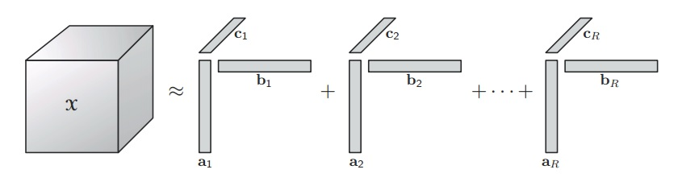
```


???

The CP decomposition factorizes a tensor into a sum of outer products of vectors. where R>0 and ar, br, cr are vectors of appropriate dimensions, and where the notation dot denotes the outer product for tensors

NP-Hard; Not orthogonal - factor matrices are not orthogonal and may have linearly dependent columns; Essentially unique (does not suffer from factor indeterminancy)

---
# Tucker3

- The Tucker Decomposition (TD) was developed by Leyard Tucker (1996)
- TD is a form of higher-order PCA. Also, referred to as Three-Mode Factor Analysis.
- TD decomposes a tensor into a **core** tensor multiplied by a matrix along each mode. For example, given a $\Large \mathbf{\mathcal{X}} \in \mathbb{R}^{I \times J \times K}$, we have
$$\Large \mathbf{\mathcal{X}} \approx \mathbf{\mathcal{G}} \times_{1} \mathbf{A} \times_{2} \mathbf{B} \times_{3} \mathbf{C} = \sum^P_{p=1}\sum^Q_{q=1}\sum^R_{r=1}g_{pqr} \mathbf{a}_{p} \circ \mathbf{b}_{q} \circ \mathbf{c}_{r}$$
- $\Large \mathbf{A} \in \mathbb{R}^{I \times P}$, $\Large \mathbf{B} \in \mathbb{R}^{J \times Q}$, and $\Large \mathbf{C} \in \mathbb{R}^{K \times R}$ are factor matrices (orthogonal) that are thought of as the principal components for each mode. $\Large \mathbf{\mathcal{G}} \in \mathbb{R}^{P \times Q \times R}$ is referred to as the core tensor. 
- A popular estimation techinque for CP decomposition is the Higher-Order Orthogonal Iteration Algorithm (see appendix)
```{r, echo=F,out.width = "300px",fig.align="center", fig.cap="Tucker Decomposition (Kolda & Bader, 2009)"}
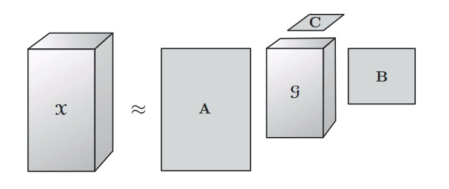
```

???

The Tucker decomposition (Tucker (1966)) decomposes a tensor into a core tensor multiplied by a matrix along each mode (i.e., transformed via a k-mode product for every k=1,2,.,N):
The core tensor entries show the level of interaction between the different components. 
Note that G might be much smaller than the original tensor X if we accept an approximation instead of an exact equality.

Suffers from factor indeterminancy; Considered a compression of data

---

# Demonstrations in R

- Return to the **tensor-tutorial.Rmd** workbook

- We will analyze the girlsgrowth dataset that is analyzed in Kroonenberg (2008) using the **rrcov3way** package

- Note at the current time, my analysis has slight differences between the results in Kroonenberg(2008) and the results here. 
  - Kroonenberg (2008) uses software call **3WayPack**

---
# Conclusions

- We learned about tensors and tensor decompositions

- We worked with tensor or multiway data in R using the **rrcov3way** package

- I hope this presentation and workbook provide a useful jumping off point to tensor decompositions and understanding the material in Kroonenberg (2008)

- Current state-of-the-art is there is no state-of-the-art. Two possible directions forward: 
  - Bentler, Poon, & Lee (1988) hava a paper on generalized multimode latent
variable models. Implement in EQS. Not well cited. 
  - OpenMx allows for knronecker product matrix multiplication (cf. Verdam & Oort, 2019)

- Useful websites:
  - http://www.psychology.uwo.ca/faculty/harshman/index.html#active
  - http://three-mode.leidenuniv.nl/
  - http://tensorlab.cms.caltech.edu/users/anima/cs165.html
  - https://github.com/JeanKossaifi/ifi-summer-school
  - https://www.youtube.com/watch?v=L8uT6hgMt00&t=1302s
  
???

Many challenging problems related to low-rank tensor approximations remain to be addressed.
- A whole new area emerges when several TNs which operate on different datasets are coupled or linked. 
- As the complexity of big data increases, this requires more efficient iterative algorithms for their computation, extending beyond the ALS, MALS/DMRG, SVD/QR and CUR/Cross-Approximation class of algorithms.
- Methodological approaches are needed to determine the kind of constraints that should be imposed on cores to extract desired hidden (latent) variables with meaningful physical interpretation.
- We need methods to reliably estimate the ranks of TNs, especially for structured data corrupted by noise and outliers.
- The uniqueness of various TN models under different constraints needs to be investigated.
- Special techniques are needed for distributed computing and to save and process huge ultra largescale tensors.
- Better visualization tools need to be developed to address large-scale tensor network representations.
  
---
# Other Decompositions

- Individual differences in scaling (INDSCAL; Carroll & Chang, 1970)

- Parallel factors for cross products (PARAFAC2; Harshman, 1972)

- CANDECOMP with linear constraints (CANDELINC; Carroll et al., 1980)

- Decomposition into directional components (DEDICOM; Harshman, 1978)

- PARAFAC and Tucker2 (PARATUCK2; Harshman & Lundy, 1996)

- Tensor Power Method (Anandkumar et al., 2014)

- Longitudinal ThreeMode Model (Verdam & Oort, 2019) 

???

Tensor Networks are another area of research (see Cichocki, 2014).

---
# Software for Tensors

- MATLAB (N-way Toolbox, CuBatch, PLS_Toolbox, Tensor Toolbox)

- R (rTensor, ThreeWay, PTaK, rrcov3way)

- FORTRAN (Multilinear Engine)

- Python (Tensorly)

- C++ (HUJI Tensor Library, FTensor, Boost.MultiArray)


---

# References

Anandkumar, A., Ge, R., Hsu, D., Kakade, S. M., & Telgarsky, M. (2014). Tensor decompositions for learning latent variable models. The Journal of Machine Learning Research, 15(1), 2773-2832.

Bentler, P. M., Poon, W. Y., & Lee, S. Y. (1988). Generalized multimode latent variable models: Implementation by standard programs. Computational Statistics & Data Analysis, 7(2), 107-118.

Carroll, J. D., & Chang, J. J. (1970). Analysis of individual differences in multidimensional scaling via an N-way generalization of "Eckart-Young" decomposition. Psychometrika, 35(3), 283-319.

Carroll, J. D., Pruzansky, S., & Kruskal, J. B. (1980). CANDELINC: A general approach to multidimensional analysis of many-way arrays with linear constraints on parameters. Psychometrika, 45(1), 3-24.

Cartwright, D., & Sturmfels, B. (2013). The number of eigenvalues of a tensor. Linear algebra and its applications, 438(2), 942-952.

Cattell, R. B. (1944). "Parallel proportional profiles" and other principles for determining the choice of factors by rotation. Psychometrika, 9(4), 267-283.

---
# References

Cattell, R. B. (1966). The data box: Its ordering of total resources in terms of possible relational systems. Handbook of multivariate experimental psychology, 67-128

Cichocki, A. (2014). Era of big data processing: A new approach via tensor networks and tensor decompositions. arXiv preprint arXiv:1403.2048.

Choi, J. Y., Hwang, H., & Timmerman, M. E. (2018). Functional Parallel Factor Analysis for Functions of One-and Two-dimensional Arguments. Psychometrika, 83(1), 1-20.

De Lathauwer, L., De Moor, B., & Vandewalle, J. (2000). A multilinear singular value decomposition. SIAM journal on Matrix Analysis and Applications, 21(4), 1253-1278.

Jordan, C. (1874). Mémoire sur les formes bilinéaires. Journal de mathématiques pures et appliquées, 19, 35-54.

Harshman, R. A. (1970). Foundations of the PARAFAC procedure: Models and conditions for an" explanatory" multimodal factor analysis.

Harshman, R. (1972). parafac2: Extensions of a Procedure for "Explanatory" Factor-Analysis and Multidimensional Scaling. The Journal of the Acoustical Society of America, 51(1A), 111-111.


---
# References

Harshman, R. A. (1978). Models for analysis of asymmetrical relationships among N objects or stimuli. In First Joint Meeting of the Psychometric Society and the Society of Mathematical Psychology, Hamilton, Ontario, 1978.

Harshman, R. A., & Lundy, M. E. (1996). Uniqueness proof for a family of models sharing features of Tucker's three-mode factor analysis and PARAFAC/CANDECOMP. Psychometrika, 61(1), 133-154.

Hitchcock, F. L. (1927). The expression of a tensor or a polyadic as a sum of products. Journal of Mathematics and Physics, 6(1-4), 164-189.

Kolda, T. G. (2006). Multilinear operators for higher-order decompositions (No. SAND2006-2081). Sandia National Laboratories.

Kolda, T. G., & Bader, B. W. (2009). Tensor decompositions and applications. SIAM review, 51(3), 455-500.

Kossaifi, J., Panagakis, Y., & Pantic, M. (2016). Tensorly: Tensor learning in python. arXiv preprint arXiv:1610.09555.

Kroonenberg, P. M. (2008). Applied multiway data analysis (Vol. 702). John Wiley & Sons.

---
# References

Li, J., Bien, J., & Wells, M. T. (2018). rTensor: An R Package for Multidimensional Array (Tensor) Unfolding, Multiplication, and Decomposition. Journal of Statistical Software, 87(10), 1-31.

Nesselroade, J. R., & Cattell, R. B. (Eds.). (1988). Handbook of multivariate experimental psychology. Springer Science & Business Media.

Rabanser, S., Shchur, O., & Günnemann, S. (2017). Introduction to tensor decompositions and their applications in machine learning. arXiv preprint arXiv:1711.10781.

Tucker, L. R. (1966). Some mathematical notes on three-mode factor analysis. Psychometrika, 31(3), 279-311.

---
class: inverse, center, middle

# dakota.cintron@uconn.edu 

---
# ALS Algorithm

```{r, echo=F,out.width = "700px",fig.align="center", fig.cap="ALS Algorithm for CP (Kolda & Bader, 2009)"}
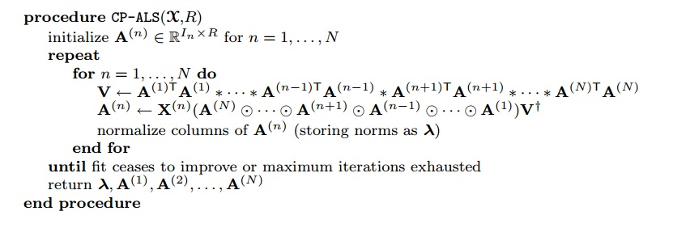
```

---
# HOOI Algorithm

```{r, echo=F,out.width = "700px",fig.align="center", fig.cap="HOOI Algorithm for TD (Kolda & Bader, 2009)"}
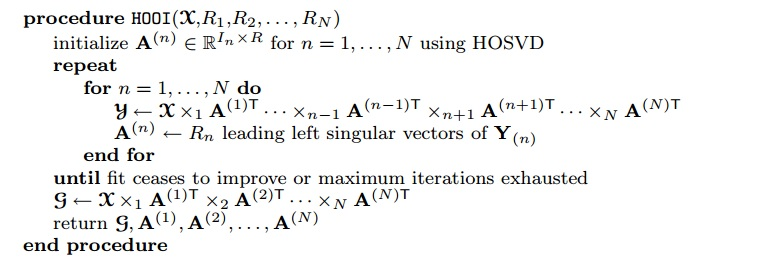
```

---
# Explanation ALS

```{r, echo=F,out.width = "450px",fig.align="center", fig.cap="CP Decomposition (Kolda & Bader, 2009)"}

```

- Baisc idea of fitting the model using ALS

$$\Large \text{min}_{\textbf{A,B,C}}|| \mathbf{\mathcal{X}} -  \mathbf{\mathcal{M}}||^2 \text{s.t.}  \mathbf{\mathcal{M}}=[[\textbf{A,B,C}]]$$ 
- Essentially least squares problem $\Large \text{min}_{\textbf{A,B,C}}\sum_{ijk}(x_{ijk} - \sum_{l})a_{il}b_{jl}c_{kl})^2$

- Repeat until convergence
  - Step 1: Fix **b** & **c** $\Large \text{min}_{\color{red}{\textbf{A}}}\sum_{ijk}(x_{ijk} - \sum_{l})\color{red}{a_{il}}b_{jl}c_{kl})^2$
  - Step 2: Fix **a** & **c** $\Large \text{min}_{\color{red}{\textbf{B}}}\sum_{ijk}(x_{ijk} - \sum_{l})a_{il}\color{red}{b_{jl}}c_{kl})^2$
  - Step 3: Fix **a** & **b** $\Large \text{min}_{\color{red}{\textbf{C}}}\sum_{ijk}(x_{ijk} - \sum_{l})a_{il}b_{jl}\color{red}{c_{kl}})^2$

???
We are fixing the relevant a components in the sum of the outer products of the rank-1 tensors or vector outer products

Note the double backet notation [[A,B,C]] the sum of the outer products